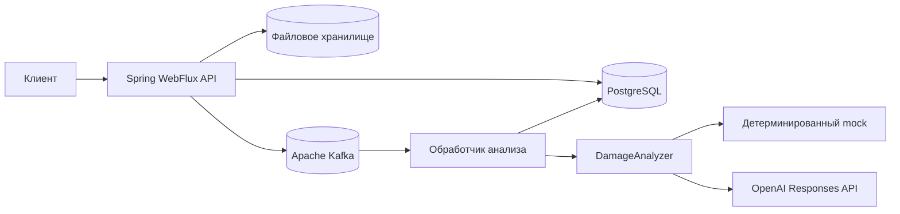
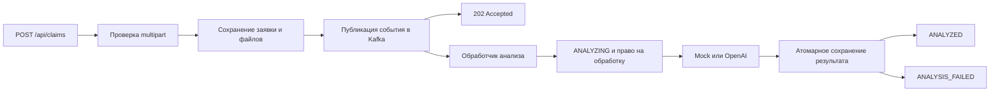

# Car Damage Claims AI - Java

[](https://github.com/steel-snake-sx/car-damages-ai-java-ver/actions/workflows/ci.yml)


Бэкенд для асинхронного анализа повреждений автомобиля по фотографиям.

Пользователь создаёт заявку, указывает данные автомобиля и загружает фотографии. Бэкенд сохраняет заявку и файлы, публикует событие в Kafka, после чего обработчик выполняет анализ в режиме mock или через OpenAI Responses API и сохраняет результат в PostgreSQL.

## Основные возможности

- создание заявки через `multipart/form-data`;
- данные автомобиля и от 1 до 3 фотографий в форматах JPEG и PNG;
- локальное файловое хранилище с томом Docker;
- асинхронная обработка заявок через Kafka;
- детерминированный `MockDamageAnalyzer` по умолчанию;
- необязательный анализ через OpenAI Responses API;
- JWT-аутентификация и API администратора;
- статусы `ANALYSIS_PENDING`, `ANALYZING`, `ANALYZED`, `ANALYSIS_FAILED`;
- OpenAPI 3 и Swagger UI;
- PostgreSQL, Flyway и Testcontainers.

## Как обрабатывается заявка

1. Клиент отправляет multipart-заявку с данными автомобиля и фотографиями.
2. Изображения проверяются до сохранения.
3. Заявка и её метаданные сохраняются в PostgreSQL.
4. Файлы и записи в БД проходят согласованный сценарий сохранения.
5. После фиксации транзакции событие публикуется в Kafka.
6. HTTP-ответ `202 Accepted` отправляется после подтверждения от Kafka.
7. Обработчик Kafka получает заявку и право на её обработку.
8. Статус заявки меняется на `ANALYZING`.
9. `DamageAnalyzer` получает изображения и возвращает структурированный результат.
10. Результат анализа, найденные повреждения и конечный статус сохраняются в одной транзакции.
11. Статус заявки меняется на `ANALYZED` или `ANALYSIS_FAILED`.

## Архитектура

Проект представляет собой одно приложение на Spring Boot с модульной монолитной структурой. Код организован по функциональным пакетам: отдельно находятся заявки, аутентификация, анализ и работа с хранилищами.

WebFlux обслуживает HTTP-запросы, PostgreSQL подключён через R2DBC, Kafka отделяет создание заявки от её анализа, а `DamageAnalyzer` скрывает детали конкретного анализатора. Фотографии хранятся в локальной файловой системе и подключаются к приложению через том Docker.

### Компонентная схема



### Сценарий обработки заявки



## Технологический стек

| Область | Технологии |
| --- | --- |
| Язык | Java 21 |
| Фреймворк | Spring Boot 4.1.1, Spring WebFlux |
| Реактивный стек | Project Reactor |
| Аутентификация | Spring Security, JWT Bearer, BCrypt |
| Хранение данных | PostgreSQL, Spring Data R2DBC |
| Миграции | Flyway |
| Обмен сообщениями | Apache Kafka |
| Анализ изображений | OpenAI Responses API, детерминированный mock |
| Файлы | Локальная файловая система |
| Документация API | OpenAPI 3, Swagger UI, springdoc-openapi |
| Инфраструктура | Docker Compose |
| Тестирование | JUnit 5, Mockito, Testcontainers |
| Сборка | Gradle |

## Технические особенности

- WebFlux и R2DBC используются без блокирующих операций в цикле обработки событий.
- Операции с файлами и потенциально блокирующий вызов `KafkaTemplate.send` выполняются на `boundedElastic`.
- Публикация в Kafka начинается после фиксации транзакции в БД, а подтверждение брокера ожидается до ответа `202`.
- Анализ изображений выполняется после HTTP-запроса, в обработчике Kafka.
- Ретрай AI и ретрай сохранения разделены: сбой PostgreSQL не запускает повторный платный AI-вызов в рамках одной доставки сообщения.
- Для заявки фиксируются текущий владелец и время действия его права на обработку. Если Kafka повторно доставит сообщение другому обработчику, старый обработчик не сможет сохранить результат.
- Результат анализа, найденные повреждения и конечный статус сохраняются атомарно.
- OpenAI возвращает данные в строгом структурированном формате, а в запросе используется `store=false`.
- `MockDamageAnalyzer` позволяет запустить проект без ключа OpenAI.
- PostgreSQL- и Kafka-сценарии проверяются через Testcontainers.

## Интеграции

| Интеграция | Как используется | Локальный режим |
| --- | --- | --- |
| OpenAI Responses API | Анализ фотографий и формирование структурированного результата | Без ключа используется `MockDamageAnalyzer` |
| Apache Kafka | Очередь и асинхронная передача заявки обработчику | Запускается через Docker Compose |
| PostgreSQL | Заявки, статусы и результаты анализа | Запускается через Docker Compose |
| Файловая система | Сохранение загруженных фотографий | Используется локальный том |

## Локальный запуск

Требования:

- Docker Desktop с Docker Compose;
- Git.

Для основного сценария Java и Gradle устанавливать локально не нужно.

### Запуск через Docker

Из корня репозитория выполните:

```bash
docker compose up --build
```

Команда собирает приложение и запускает PostgreSQL, Kafka и приложение Spring Boot. Flyway применяет миграции автоматически. По умолчанию используется mock-анализ, поэтому ключ OpenAI не нужен.

Адреса после запуска:

- Swagger UI: `http://localhost:8080/swagger-ui.html`;
- OpenAPI JSON: `http://localhost:8080/v3/api-docs`;
- OpenAPI YAML: `http://localhost:8080/v3/api-docs.yaml`.

Остановить контейнеры:

```bash
docker compose down
```

Удалить PostgreSQL, Kafka и загруженные изображения вместе с томами:

```bash
docker compose down -v
```

## Демонстрация

В Docker Compose настроена демонстрационная учётная запись администратора:

- Email: `admin@localhost`;
- Пароль: `admin123`.

Проверка через Swagger UI:

1. Откройте Swagger UI.
2. Выполните `POST /api/auth/login` с демонстрационными учётными данными.
3. Скопируйте значение `accessToken` и вставьте его в форму `Authorize`.
4. Выполните `POST /api/claims`, заполните `carBrand`, `carModel`, `carYear` и выберите от 1 до 3 изображений.
5. Получите `202 Accepted` и сохраните `id` заявки.
6. Проверяйте `GET /api/claims/{id}/status`.
7. После `ANALYZED` откройте `GET /api/admin/claims/{id}`.

## Конфигурация

Команда `docker compose up --build` работает без `.env`: для демонстрации используются безопасные локальные значения по умолчанию.

Файл `.env.example` содержит те же значения-заглушки и может использоваться как основа для локальных переопределений. Реальные секреты добавлять в него нельзя.

Для включения OpenAI задайте переменные окружения или создайте локальный `.env`:

```env
AI_PROVIDER=openai
OPENAI_API_KEY=<your-key>
OPENAI_MODEL=gpt-4.1
```

После этого перезапустите Docker Compose:

```bash
docker compose down
docker compose up --build
```

Если задано `AI_PROVIDER=openai`, но отсутствует `OPENAI_API_KEY`, приложение завершит запуск с ошибкой конфигурации. Подставного значения для ключа нет.

## API

| Метод | Endpoint | Доступ | Назначение |
| --- | --- | --- | --- |
| `POST` | `/api/auth/login` | публичный | Получить JWT |
| `POST` | `/api/claims` | публичный | Создать заявку, ответ `202` |
| `GET` | `/api/claims/{id}/status` | публичный | Получить идентификатор и статус заявки |
| `GET` | `/api/admin/claims` | JWT с ролью `ADMIN` | Получить список заявок |
| `GET` | `/api/admin/claims/{id}` | JWT с ролью `ADMIN` | Получить заявку и результат анализа |

Для создания заявки используются multipart-поля:

- `carBrand`;
- `carModel`;
- `carYear`;
- `images` - от 1 до 3 файлов JPEG или PNG.

Полное описание запроса и ответов доступно в Swagger UI. Ответ администратора содержит данные автомобиля, причину ошибки при наличии, результат анализа, найденные повреждения и значение `confidence`.

## Проверка качества

Команды для проверки из корня репозитория:

```bash
./gradlew cleanTest test
./gradlew build
docker compose config
```

В Windows используйте `gradlew.bat` вместо `./gradlew`.

CI запускает `cleanTest build`, проверяет конфигурацию Docker Compose и собирает образ Docker.

## Ограничения и компромиссы

- Kafka используется как асинхронная граница внутри одного приложения; отдельные микросервисы не добавляются.
- Transactional Outbox и DLT намеренно не реализованы.
- Транзакция БД и публикация в Kafka разделены, поэтому после фиксации БД остаётся промежуток, в котором процесс может завершиться до публикации события.
- После полного падения процесса запрос к OpenAI может быть выполнен повторно.
- Владелец и время действия права на обработку защищают от наложения обработчиков при остановке или перераспределении Kafka, но не являются универсальным планировщиком распределённых задач.
- Расчёт стоимости, пользовательский интерфейс, электронная почта, DOCX и XLSX в Java-версии не реализованы.

## Статус проекта

Функциональная Java-версия завершена: в репозитории есть API заявок, JWT-аутентификация администратора, обработка через Kafka, mock/OpenAI-анализ, атомарное сохранение результата, OpenAPI-документация и запуск через Docker Compose.
