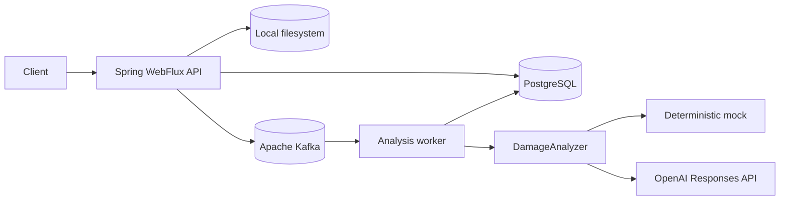
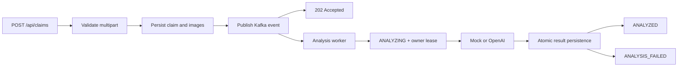

# Car Damage Claims AI - Java

[](https://github.com/steel-snake-sx/car-damages-ai-java-ver/actions/workflows/ci.yml)


Backend-сервис для асинхронного анализа повреждений автомобиля по фотографиям.

Пользователь создаёт заявку, указывает автомобиль и загружает фотографии. Backend сохраняет заявку и изображения, публикует событие в Kafka, а обработчик выполняет анализ через deterministic mock или OpenAI Responses API и сохраняет структурированный результат в PostgreSQL.

## Основные возможности

- публичное создание заявки через `multipart/form-data`;
- данные автомобиля и от 1 до 3 фотографий JPEG/PNG;
- локальное файловое хранилище с Docker volume;
- асинхронный анализ через Kafka;
- deterministic `MockDamageAnalyzer` по умолчанию;
- опциональный анализ через OpenAI Responses API;
- JWT authentication и admin API;
- статусы `ANALYSIS_PENDING`, `ANALYZING`, `ANALYZED`, `ANALYSIS_FAILED`;
- Swagger UI и OpenAPI 3;
- PostgreSQL, Flyway и Testcontainers.

## Ключевой сценарий работы

1. Client отправляет multipart-заявку с автомобилем и фотографиями.
2. Изображения валидируются до сохранения.
3. Claim и metadata сохраняются в PostgreSQL.
4. Filesystem и DB проходят существующий consistency flow.
5. После commit событие публикуется в Kafka.
6. HTTP возвращает `202 Accepted` после broker acknowledgement.
7. Kafka worker получает заявку и получает owner/lease.
8. Claim переходит в `ANALYZING`.
9. `DamageAnalyzer` получает изображения и возвращает structured result.
10. Result и findings сохраняются в одной транзакции с terminal status.
11. Claim становится `ANALYZED` или `ANALYSIS_FAILED`.

## Архитектура

Проект представляет собой один Spring Boot deployable в виде modular monolith. Код организован package-by-feature: HTTP, authentication, claims, analysis и persistence находятся в своих feature-пакетах.

WebFlux обслуживает HTTP, PostgreSQL подключён через R2DBC, Kafka является asynchronous boundary, а `DamageAnalyzer` изолирует внешний AI-контракт от orchestration-кода. Фотографии хранятся в локальной filesystem, подключённой как Docker volume.

### Компонентная архитектура



### Обработка заявки



## Технологический стек

| Область | Технологии |
| --- | --- |
| Language | Java 21 |
| Framework | Spring Boot 4.1.1, Spring WebFlux |
| Reactive | Project Reactor |
| Auth | Spring Security, JWT Bearer, BCrypt |
| Data | PostgreSQL, Spring Data R2DBC |
| Migrations | Flyway |
| Messaging | Apache Kafka |
| AI | OpenAI Responses API, deterministic mock |
| Storage | Local filesystem |
| API docs | OpenAPI 3, Swagger UI, springdoc-openapi |
| Infrastructure | Docker Compose |
| Tests | JUnit 5, Mockito, Testcontainers |
| Build | Gradle |

## Backend-особенности / Технические акценты

- WebFlux и R2DBC используются без блокировки event loop.
- Filesystem операции и потенциально блокирующий `KafkaTemplate.send` изолированы на `boundedElastic`.
- Kafka publish выполняется после DB transaction commit, а broker acknowledgement ожидается до ответа `202`.
- AI processing вынесен за пределы HTTP request.
- AI retry отделён от persistence retry: DB outage не запускает платный AI повторно в одной delivery.
- Owner token и lease защищают overlapping processing; stale worker не может сохранить terminal result.
- Result, findings и terminal status сохраняются атомарно.
- OpenAI использует strict structured output и `store=false`.
- Mock analyzer позволяет запустить demo без OpenAI key.
- PostgreSQL и Kafka сценарии проверяются через Testcontainers.

## Интеграции

| Интеграция | Как используется | Локальный режим |
| --- | --- | --- |
| OpenAI Responses API | Анализ фотографий и structured damage result | Без key используется `MockDamageAnalyzer` |
| Apache Kafka | Очередь и asynchronous boundary | Поднимается Docker Compose |
| PostgreSQL | Claims, statuses и analysis result | Поднимается Docker Compose |
| Filesystem | Сохранение загруженных фотографий | Используется local volume |

## Локальный запуск

Требования:

- Docker Desktop с Docker Compose;
- Git.

Java и Gradle локально не нужны для основного demo-запуска.

### Запуск через Docker

Из корня репозитория:

```bash
docker compose up --build
```

Команда собирает приложение и запускает PostgreSQL, Kafka и Spring Boot app. Flyway применяет migrations автоматически. По умолчанию используется mock AI, поэтому OpenAI key не требуется.

Адреса:

- Swagger UI: `http://localhost:8080/swagger-ui.html`;
- OpenAPI JSON: `http://localhost:8080/v3/api-docs`;
- OpenAPI YAML: `http://localhost:8080/v3/api-docs.yaml`.

Остановить контейнеры:

```bash
docker compose down
```

Полностью очистить PostgreSQL, Kafka и загруженные изображения:

```bash
docker compose down -v
```

Флаг `-v` удаляет named volumes с данными. Используйте его для чистого demo-запуска.

## Demo

В Docker Compose настроен demo admin:

- Email: `admin@localhost`;
- Password: `admin123`.

Проверка через Swagger:

1. Откройте Swagger UI.
2. Выполните `POST /api/auth/login` с demo credentials.
3. Скопируйте `accessToken` и вставьте только token в `Authorize`.
4. Выполните `POST /api/claims`, заполните `carBrand`, `carModel`, `carYear` и выберите 1-3 изображения.
5. Получите `202 Accepted` и сохраните `id` заявки.
6. Проверяйте `GET /api/claims/{id}/status`.
7. После `ANALYZED` откройте admin detail через `GET /api/admin/claims/{id}`.

## Конфигурация

`docker compose up --build` работает без `.env`: для demo используются безопасные local defaults.

Файл `.env.example` содержит те же placeholder-значения и может использоваться как основа для локальных переопределений. Реальные секреты в него добавлять нельзя.

Для OpenAI режима создайте локальный `.env` или задайте переменные окружения:

```env
AI_PROVIDER=openai
OPENAI_API_KEY=<your-key>
OPENAI_MODEL=gpt-4.1
```

Затем перезапустите Compose:

```bash
docker compose down
docker compose up --build
```

При `AI_PROVIDER=openai` без `OPENAI_API_KEY` приложение откажется запускаться. Fake default для ключа не задан.

## API

| Method | Endpoint | Auth | Назначение |
| --- | --- | --- | --- |
| `POST` | `/api/auth/login` | public | Получить JWT |
| `POST` | `/api/claims` | public | Создать multipart claim, ответ `202` |
| `GET` | `/api/claims/{id}/status` | public | Получить id и status |
| `GET` | `/api/admin/claims` | `ADMIN` JWT | Список заявок |
| `GET` | `/api/admin/claims/{id}` | `ADMIN` JWT | Детали и analysis result |

Для создания claim используются multipart-поля:

- `carBrand`;
- `carModel`;
- `carYear`;
- `images` - от 1 до 3 JPEG/PNG-файлов.

Полный интерактивный контракт доступен в Swagger UI. Admin detail содержит vehicle data, failure reason, analysis, findings и confidence.

## Проверка качества

Локальные команды из корня репозитория:

```bash
./gradlew cleanTest test
./gradlew build
docker compose config
```

В Windows используйте `gradlew.bat` вместо `./gradlew`.

CI запускает `cleanTest build`, проверяет Compose config и собирает Docker image.

## Backend-решения и ограничения

- Kafka используется как asynchronous boundary внутри одного deployable; отдельные микросервисы не добавляются.
- Transactional Outbox и DLT намеренно не реализованы.
- DB commit и Kafka publish разделены, поэтому после commit сохраняется crash window до публикации события.
- AI calls имеют at-least-once semantics при реальном process crash.
- Owner lease защищает overlap при Kafka stop/rebalance/redelivery, но не является general distributed scheduler.
- Pricing, frontend, email, DOCX и XLSX в Java-версии не реализованы.

## Статус проекта

Функциональный Java backend завершён: claims API, JWT admin API, Kafka-driven analysis, mock/OpenAI boundary, atomic result persistence, OpenAPI documentation и Docker Compose startup включены в репозиторий.
